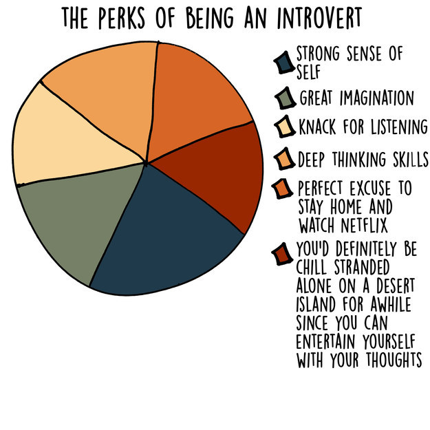

**Hi I am Kiran, a PowerShell Developer @Cisco. My job is to make things simple and easy for others :)**

<figure>
	<blockquote>
		
I know that I am intelligent, because I know that I know nothing..

		<footer>
			<cite>—Socratic Paradox</cite>
		</footer>
	</blockquote>
</figure>

*I began my career in 2003 but started software development around 2008 when [PowerShell] was introduced. Prior to this I had tried my hand at C# and vbscript but they never felt intuitive to me so didnt really pick them up. 10 years later I am still learning but I feel I have learned enough to train others in the mystic arts of powershell.*

*I was born in India and did my schooling there, graduated in Industrial Engineering & Manangment from [BMS college of Engineering][BMSCE] (India). Since graduation, I have held various roles in IT ranging from configuring desktops to providing consultancy expertise to major enterprises.*

*I have been living outside of India for the past 7 years, 5 in Singapore and the past 2 years here in the Netherlands soaking up the precious little sunshine available in Amsterdam.*

<figure class="float-right" style="width: 240px">
	
</figure>

*On a personal front I am an [introvert] by nature love reading books(grew up reading [Hardy Boys] & [Famous Five] ) , enjoy Swmimming, listening to music on my [KEF LS50 Wireless] speakers and watching Netflix. I rate [Seinfeld] as the best show ever, followed by [breaking bad], [Dexter] & [Game of Thrones].Bit of a gadget geek love apple products.*

[introvert]: https://mymodernmet.com/anna-borges-introvert-graphs/
[Hardy Boys]:https://www.goodreads.com/series/40963-hardy-boys
[Famous Five]:https://www.goodreads.com/search?q=famous+five
[Seinfeld]:https://www.imdb.com/title/tt0098904/
[Dexter]:https://www.imdb.com/title/tt0773262/?ref_=nv_sr_1
[Breaking Bad]:https://www.imdb.com/title/tt0903747/?ref_=nv_sr_1
[Game of Thrones]:https://www.imdb.com/title/tt0944947/?ref_=nv_sr_1
[KEF LS50 Wireless]:https://www.whathifi.com/kef/ls50-wireless/review
[BMSCE]:http://www.bmsce.in/
[PowerShell]:https://docs.microsoft.com/en-us/powershell/scripting/powershell-scripting?view=powershell-6