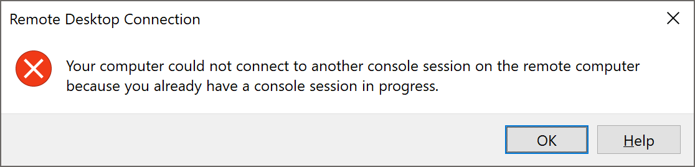
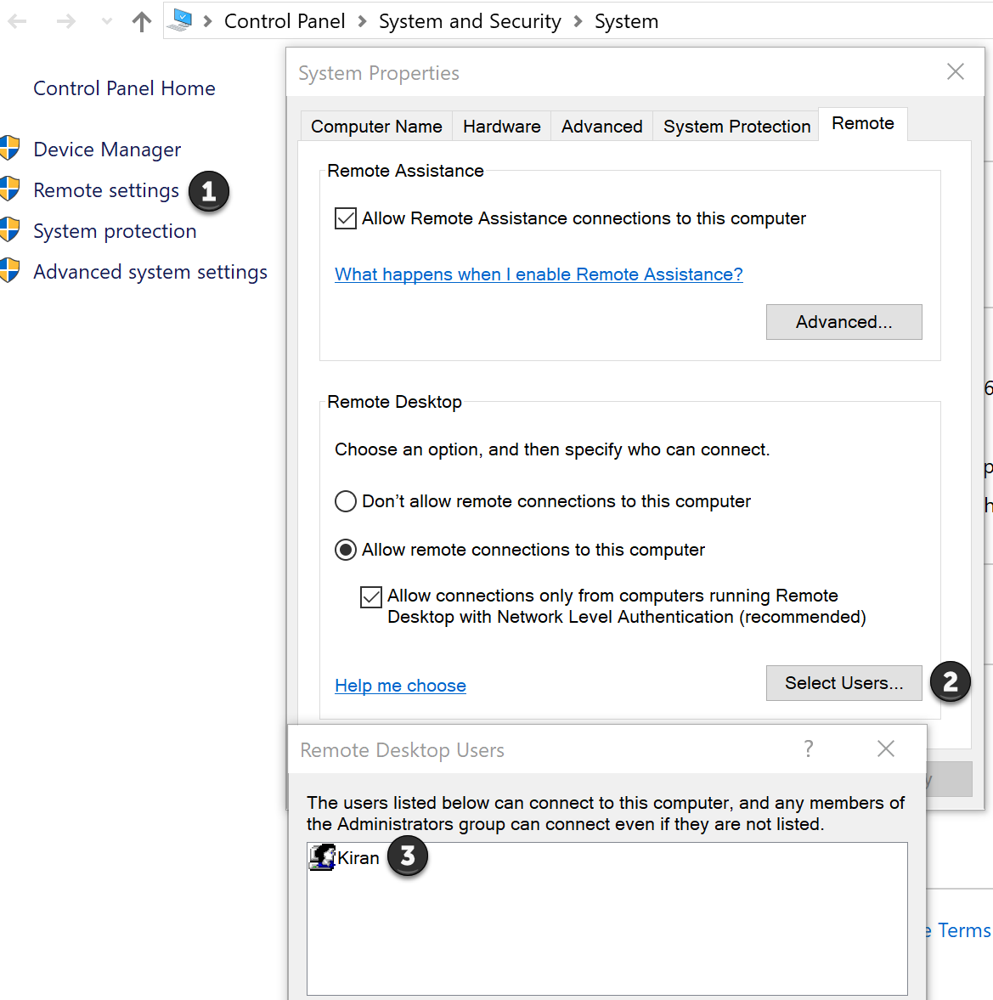

## The Problem

While trying to rdp from one windows machine to another windows machine you get the following error:

<p align="center">
<figure  style="width: 700px">
	
	<figcaption>RDP Error</figcaption>
</figure>
</p>

## The Solution
>The IPaddress of the remote computer had changed so I just had to find out the new ipaddress and rdp to it and thats it!


## The Story
Since the error mentioned another session in progress I opened up the task manager and looked under the users tab only to find it empty so next I peered through the list of processes trying to find any **"remote desktop connection.exe"** that I could kill but none were found.

### &nbsp;1.1&nbsp;&nbsp;Checking Connectivity
-----

I had been experiencing some network issues lately so I checked and made sure that both computers were connected to the network and could ping each other.

```bash

#From source ping remote pc
ping 192.168.1.6

#from remote ping source pc
ping 192.168.1.5

```

<br>

### &nbsp;1.2&nbsp;&nbsp;Verifying RDP User Access
-----

The user that I was trying to connect already had access to the remote computer and the firewall still retained the exception for the rdp connection so this seemed rather puzzling.

<figure class="is-shadowless" style="width: 560px">
	
	<figcaption>RDP User</figcaption>
</figure>


### &nbsp;1.3&nbsp;&nbsp;Clearing the DNS cache
----

In the hope of finding a quick solution I googled the error and sure enough there were a lot of folks grappling with the same issue so I thought I was in luck but nope I was mistaken.
The solutions on the internet varied from rebooting the machines, rebooting the router,adding static routes, logging out and logging back in etc.

There was one step that made sense to me and that was to run the folllowing commands from an [elevated(administrator)](https://www.computerhope.com/jargon/e/elevated.htm) command prompt.
<br>

```bash
ipconfig /release
ipconfig /renew
```


I couldnt try these because on my network I was using wifi and the steps above are only valid when you have a wired connection.

I did clear out the dns cache though just to make sure that there were no stale dns entries:


```bash
ipconfig /flushdns
```


After all this I was still getting the same old error. Finally the step that worked for me was this:

1. Go to the remote machine and physically log in at the console and check the IPaddress
2. verify that you are trying to connect to the same ipaddress as the one found in step 1

## Explanation

In my case the remote computer had an IPaddress of `192.168.1.7` whereas I was trying to rdp to `192.168.1.6` .

What had happened was that the remote computer had somehow lost the IPaddress it previosuly held `192.168.1.6` and obtained a new one `192.168.1.7`.To make matters worse my Ipad now held the troublesome IPaddress of `192.168.1.6` which explained why I was able to ping it.

Since this was working before it never occured to me that the IPaddress might have changed.

Essentially I was trying to rdp from my windows 10 machine to my Ipad which was never going to work but the error message was misleading and hence the saga that followed. 

I have listed all the steps that I tried because some of them may help people having the same or similar issue.

Have a great day!