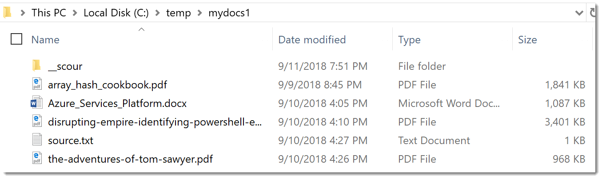
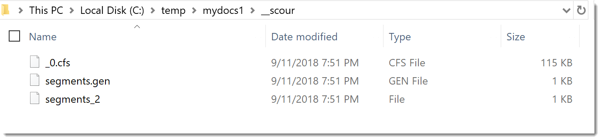
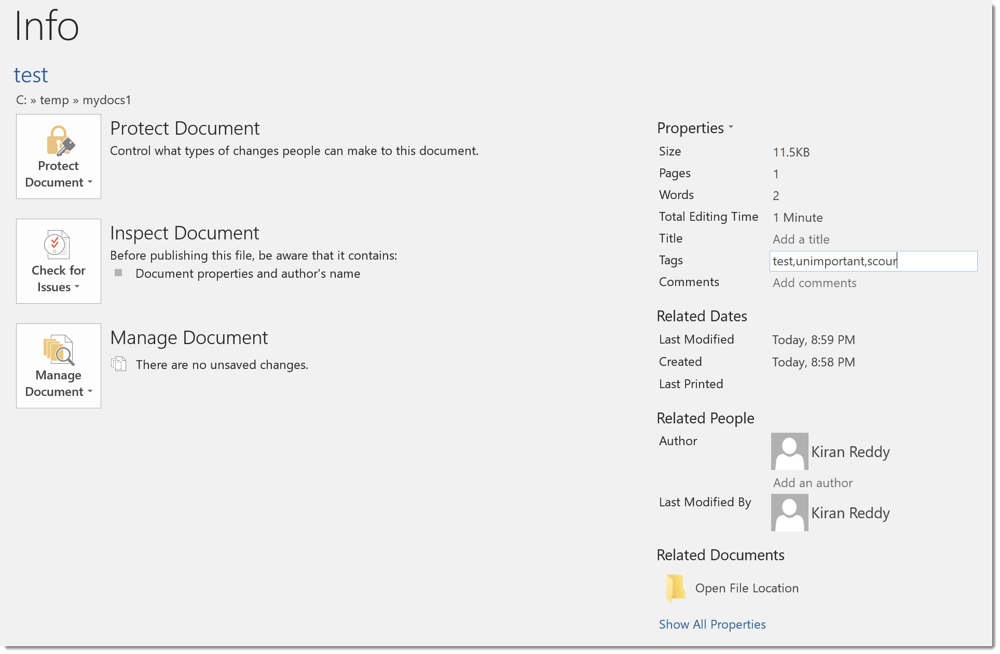

## What Is it
[Scour](https://www.powershellgallery.com/packages/Scour/1.1) is a powershell module created by [Lee Holmes](http://www.leeholmes.com/blog/2018/08/28/scour-fast-personal-local-content-searches/). It enables searching of text content on the filesystem based on the open source software [apache lucene](https://lucene.apache.org/).

## How Does it Work
Scour creates indexed databases at the root of each folder that needs to be searched. Each database indexes content not only from files at the root but also in subfolders as well. The database location is fixed and contained in a folder called **"__scour"**

## Install
You install the module from the powershell gallery via:

```powershell
Install-Module Scour -Scope CurrentUser
```

>**Note:** Works with `Powershell v5` and above


## Indexing Folders
Lets say you wanted to index 2 folders:

- *c:\temp\mydocs1*
- *c:\mydocs2*

you would create a lucene index in each folder by running:

```bash
cd C:\temp\mydocs1
Initialize-ScourIndex

cd c:\mydocs2
Initialize-ScourIndex
```
</br>

Once the index has been created you should see a new folder named `__scour`:

<figure style="width: 660px">
	
	<figcaption>My Docs-1</figcaption>
</figure>

The contents of the index looks something like this:

<figure  style="width: 660px">
	
	<figcaption>Lucene Database</figcaption>
</figure>


## Supported Types
By default lucene can index most text files including files from popular programming languages such as **powershell, python, c#, javascript etc**. but it cannot index **Microsoft office(docx, xlsx, pptx) or pdf's.**
To overcome this we can make use of an open source library called [TIKA](https://github.com/KevM/tikaondotnet) for text extraction.

We download tika from nuget or github, move all dll's into a single folder and load them using reflection. After loading the Tika library we can create a tika object instance to extract office and pdf documents like so:


```powershell

# Load Tika
$lib_tika = Join-Path $PSScriptRoot -ChildPath "lib/tika"
Get-ChildItem $lib_tika -Filter *.dll | 
	Foreach-Object {
    	$null = [reflection.assembly]::loadfrom($_.FullName) 
}

# create a tika instance
$tExtractor = [TikaOnDotNet.TextExtraction.TextExtractor]::new()

# Extract text from a pdf
$pdf = "C:\temp\mydocs1\the-adventures-of-tom-sawyer.pdf"
$pdf_content = $tExtractor.Extract($pdf).Text

# Extract text from a docx file
$docx = "C:\temp\mydocs1\Azure_Services_Platform.docx"
$docx_content = $tExtractor.Extract($docx).Text

```

In addition to extracting text Tika can also extract metadata from a document. This can be very useful when you have a bunch of documents containing tags that can be indexed and searched.

We can set tags on any word document by going to:
**File --> info --> tags**

<figure class="float-right" style="width: 660px">
	
	<figcaption>Set Tags on a word document</figcaption>
</figure>

we can now test the metadata with this code:

```powershell
$docx = "C:\temp\mydocs1\test.docx"
$docx_metadata = $tExtractor.Extract($docx).metadata
$docx_metadata.GetEnumerator().where{$_.key -notmatch ":"} | sort key

Key                         Value
---                         -----
Application-Name            Microsoft Office Word
Application-Version         16.0000
Author                      Kiran Reddy
Character Count             12
Character-Count-With-Spaces 13
Content-Type                application/vnd.openxmlformats-officedocument.wordprocessingml.document
Creation-Date               2018-09-11T18:58:00Z
creator                     Kiran Reddy
date                        2018-09-11T19:00:00Z
description                 mycomment
FilePath                    C:\temp\mydocs1\test.docx
Keywords                    test,unimportant,scour
Last-Author                 Kiran Reddy
Last-Modified               2018-09-11T19:00:00Z
Last-Save-Date              2018-09-11T19:00:00Z
Line-Count                  1
modified                    2018-09-11T19:00:00Z
Page-Count                  1
Paragraph-Count             1
publisher
Revision-Number             3
subject                     test,unimportant,scour
Template                    Normal.dotm
title                       This is a test document
Total-Time                  2
Word-Count                  2
X-Parsed-By                 org.apache.tika.parser.DefaultParser, org.apache.tika.parser.microsoft.ooxml.OOXMLParser


```

## Usage

Saerching for content is as easy as:

```powershell

PS C:\temp\mydocs1> Search-ScourContent "mark twain"

    Directory: C:\temp\mydocs1

Mode                LastWriteTime         Length Name
----                -------------         ------ ----
-a----        9/10/2018   4:26 PM         990675 the-adventures-of-tom-sawyer.pdf

PS C:\temp\mydocs1>
```

> **Tip:**
by default content search is based on term query. For example 2 words separated by a space such as "mark twain" means look for the word "mark" or the word "twain" anywhere in the document. On occasions when we want the words to appear next to each other we would want to use a phrase query.
We can make any term query a phrase query by simply enclosing the words inside double quotes

### Phrase query


```powershell
# The phrase has to be in double quotes not single.
Search-ScourContent '"mark twain"'
```

The module also includes an **about`_query`_syntax.txt** which contains excellent information about the lucene engine query syntax.

## Searching on multiple fields

```powershell
# Golden needs to be in the file name, file has to have a txt extension and "2nd" needs to be in the content
PS C:\temp\mydocs1> Search-ScourContent 'path:"golden" AND path:*.txt AND 2nd'

    Directory: C:\temp\mydocs1

Mode                LastWriteTime         Length Name
----                -------------         ------ ----
-a----        9/10/2018   5:09 PM             25 The Golden Gate.txt

						**OR** 

PS C:\temp\mydocs1> Search-ScourContent '2nd' -path *golden*.txt

    Directory: C:\temp\mydocs1

Mode                LastWriteTime         Length Name
----                -------------         ------ ----
-a----        9/10/2018   5:09 PM             25 The Golden Gate.txt

```

## Gotcha's

Lets say you have 2 files in a folder such as:

```powershell
file1: "The Golden Gate.txt"
file2: "The Golden Gate Bridge.txt"

# search for file names containing the phrase Golden gate
PS C:\temp\mydocs1> Search-ScourContent 'path:"golden gate"'

    Directory: C:\temp\mydocs1

Mode                LastWriteTime         Length Name
----                -------------         ------ ----
-a----        9/10/2018  11:17 AM              0 The Golden Gate Bridge.txt

PS C:\temp\mydocs1>


```
Even though there are 2 files containing the words `golden gate` we get back just one result. This is because scour uses the `standardanalyser` to break text into [tokens](https://lucene.apache.org/core/3_0_3/api/core/org/apache/lucene/analysis/Token.html) and with the standardanalyser periods (dots) that are not followed by whitespace are kept as part of the token, including Internet domain names.

The file name `The Golden Gate.txt` is tokenized as follows:

- `Golden`
- `Gate.txt`

> **Note:** `The` is not stored because it is a *stop-word* (common English words that are usually not useful for searching.)

we can check this for ourselves by using the following function:

```powershell
# Scour Lucene utils
$luceneAssembly = Join-Path $PSScriptRoot -ChildPath "lucene\Lucene.Net.dll"
$ScourUtils = @"
using Lucene.Net.Analysis.Standard;
using Lucene.Net.Analysis.Tokenattributes;
using Lucene.Net.Index;
using Lucene.Net.QueryParsers;
using Lucene.Net.Search;
using Lucene.Net.Store;
using System;
using System.Collections.Generic;
using System.IO;

namespace Scour
{
    public class Utils
    {
        public static List<string> listTokens(string term)
        {
            var analyzer = new StandardAnalyzer(Lucene.Net.Util.Version.LUCENE_30);
            var tokenStream = analyzer.TokenStream(null, new StringReader(term));
            var termlist = new List<string>();

            tokenStream.Reset();
            while (tokenStream.IncrementToken())
            {
                var termAttr = tokenStream.GetAttribute<ITermAttribute>();
                var analyzedTerm = termAttr.Term;
                termlist.Add(analyzedTerm);
                
            }
            tokenStream.End();
            tokenStream.Dispose();
            return termlist;
        }

    }
}

"@
Add-Type -TypeDefinition $ScourUtils -Language CSharpVersion3 -ReferencedAssemblies $luceneAssembly

# Test the tokenization for period without space
PS C:\temp\mydocs1> [scour.utils]::listTokens("The Golden Gate.txt")
golden
gate.txt
PS C:\temp\mydocs1>

# Tokenization for period with space
PS C:\temp\mydocs1> [scour.utils]::listTokens("The Golden Gate .txt")
golden
gate
txt
PS C:\temp\mydocs1>

```


</br>
</br>

 To workaround this we may:

- Use an `OR` query
  
```powershell
PS C:\temp\mydocs1> Search-ScourContent 'path:"golden gate" path:"golden gate.txt"'

    Directory: C:\temp\mydocs1

Mode                LastWriteTime         Length Name
----                -------------         ------ ----
-a----        9/10/2018  11:17 AM              0 The Golden Gate.txt
-a----        9/10/2018  11:17 AM              0 The Golden Gate Bridge.txt

PS C:\temp\mydocs1>
```
- change the data or 
- create a custom tokenfilter which will take a token and process it further breaking it into sub-tokens.


## Points to Note
- ___Cannot Update the Index:___ As of now there is not a way to update the index but since the filehash has been added to the database I think there may be a possibility of adding an update function in the future.
  
- ___Old Version:___ The lucene version used `3.0.3` is pretty old and dates back to 2012 but that is latest stable version available. There is a newer version released in 2017 but its in beta and contains numerous API changes with most of the classes separated into their own libraries.

Hope you found this useful, have a great day!